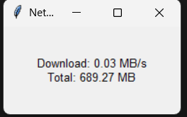

# Network Speed Monitor (Windows)

A lightweight desktop application built with **Python** and **Tkinter** that displays:

- Real-time download speed (MB/s)
- Total downloaded data (MB)
- Always-on-top floating window

## Screenshot

---

## How to Run

### Option 1 – Run from Source

1. Install Python
2. Install dependencies:

pip install -r requirements.txt

3. Run the application:

python app.py

---

### Option 2 – Run Executable

Download the `.exe` file from the **Releases** section and run it directly.

(No Python installation required)

---

## Technologies Used

- Python
- Tkinter
- psutil
- PyInstaller

---

## Features

- Updates every 1 second
- Lightweight and minimal UI
- Windows compatible

---

## License

MIT License
